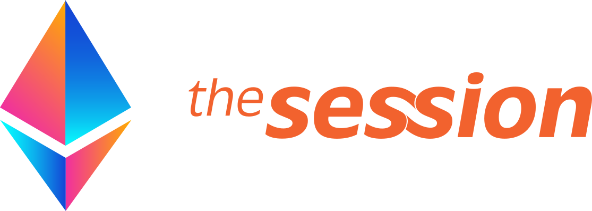

# ETHOnline 2023 - The Session

## Team

-   [Eduardo Aire](https://github.com/eduairet) - Fullstack Developer
-   [Goutham Denthaje](https://github.com/dkgoutham) - Smart Contract Developer
-   [Pamela Landgrave](https://github.com/PLandgrave) - UX/UI Designer

## Tech Stack

-   [**`Figma`**](https://www.figma.com) - UX/UI
-   [**`Push Protocol`**](https://push.org) - Meeting notifications
-   [**`XMTP`**](https://xmtp.org/built-with-xmtp) - Communication
-   [**`Filecoin`**](https://filecoin.io) - Meeting data
-   [**`Cometh`**](https://cometh.io/) - Biometric authentication
-   [**`Mantle`**](https://www.mantle.xyz) - Network and smart contracts
-   [**`Sismo`**](https://docs.sismo.io) - User data
-   [**`The Graph`**](https://thegraph.com) - DApp subgraph
-   [**`Next.js`**](https://nextjs.org) Frontend

## Flowcharts

#### DApp

